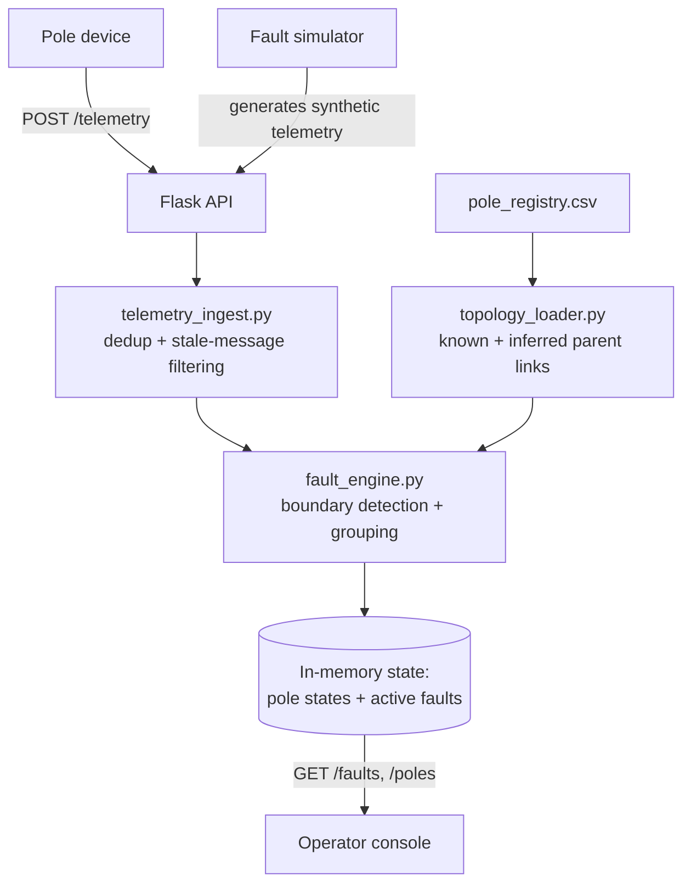

# Architecture

## Data flow

The pipeline is intentionally linear and stateless per request: every new
telemetry message triggers a full recompute of pole state and faults from
the full message history held in memory. At the current scale (a few
thousand simulated poles, not the full 38,400) this is fast enough; see
"Known limitations" below for what would change at production scale.

## Data sourcing and ingestion

Telemetry arrives as JSON POSTs matching the assignment's payload shape
(`device_id`, `pole_id`, `event`, `energized`, `ts`, `seq`). Two problems are
handled at this layer, both described in `02-data-and-systems.md`:

- **Duplicates** (at-least-once delivery): a message is only applied if its
  `seq` is higher than the last `seq` seen for that `device_id`.
- **Out-of-order / stale arrivals**: because `seq` is monotonic per device
  and `ts` is not trustworthy (clock skew up to ±90s), ordering decisions
  use `seq` exclusively. A late-arriving message with a lower `seq` than
  what's already recorded is discarded rather than overwriting newer state.

This is implemented in `telemetry_ingest.py::reduce_telemetry_to_pole_states`.

## Storage and internal model

State is currently held in memory (a Python dict of `pole_id -> energized`,
plus the message history). This is a deliberate scope cut for the take-home
- see DECISIONS.md. The topology itself is represented as a simple
`{pole_id: parent_pole_id}` map, which is sufficient because the network is
guaranteed radial (no loops) per the problem brief - this lets every
traversal (finding a boundary, collecting downstream poles) be a simple
tree walk with no cycle detection needed.

## The localization algorithm

Implemented in `fault_engine.py::find_faults`.

**Core idea:** a fault is a live→dark boundary, not a property of any single
pole. For every dark pole, check whether its parent (immediate upstream
pole) is live. If so, this pole is a *candidate* fault boundary.

**Filtering false candidates:** a dark pole whose children are *all* live is
physically impossible as a real outage (current is clearly still flowing
past it, since its children have power) - this is treated as a lying/dead
sensor, not a fault, and is excluded.

**Grouping:** once a genuine boundary is found, every dark pole downstream
of it (via a depth-first walk of the children map) is attributed to that
one fault as `downstream_affected`, rather than generating a separate alert
per pole. This directly addresses the "40 alerts for one snapped wire"
failure mode called out in the brief.

**Multiple simultaneous faults:** because every dark pole is checked
independently for the "is my parent live" condition, two unrelated boundary
points (e.g. two branches off the same distribution transformer) are
naturally detected as two separate faults, without extra logic to
distinguish them.

**Complexity:** each fault check is O(depth of subtree) to walk descendants;
across all poles this is O(N) per recompute, where N is the pole count,
since every pole is visited at most a constant number of times across all
boundary checks combined.

**Known failure case:** if the inferred topology (see below) places a pole
under the wrong parent, a real fault can be misclassified as a dead sensor
- observed directly during testing, see DECISIONS.md.

## The missing-topology problem

Roughly 60% of transformers have no recorded `parent_pole_id` /
`seq_on_line`. The approach taken (`topology_loader.py::infer_missing_topology`):

1. Poles with a known parent are trusted as-is.
2. Poles with a `seq_on_line` but no parent are recognized as deliberate
   roots (directly off the transformer) — this is *known* data, not missing
   data, and is distinguished from true gaps.
3. For poles missing both fields, the nearest other pole on the same
   transformer (by GPS haversine distance) is assigned as the inferred
   parent. Each inferred pole becomes an anchor for subsequent inference,
   so an unknown region can "chain" outward from known anchors.
4. Every fault whose span touches an inferred edge is reported with
   `confidence: "low - inferred topology"` instead of `"high"`, and this is
   surfaced in the operator console as a badge.

This was chosen over the alternative of degrading to DT-level (rather than
span-level) localization for unknown regions, because geographic proximity
on a radial LT line is a reasonably strong prior — poles physically near
each other are very likely wired together — and a specific (if uncertain)
span is more actionable for a crew than "somewhere under this transformer."
The tradeoff is honestly reported via the confidence field rather than
hidden.

## Noise handling

- **Dead sensor vs. real outage:** handled by the "all children live" check
  above.
- **Scheduled outages:** not yet wired into the fault engine — see
  DECISIONS.md for what's cut and why.

## API surface

| Method | Path | Purpose |
|--------|------|---------|
| GET | `/` | Health check, links to console |
| GET | `/dashboard` | Operator console UI |
| POST | `/telemetry` | Ingest one telemetry message |
| GET | `/faults` | Current active faults with confidence |
| GET | `/poles` | Current state of every pole |
| GET | `/topology` | Resolved topology + per-edge confidence |
| POST | `/simulator/inject-fault` | Inject a fault at a pole (body: `{"pole_id": "..."}`) |
| POST | `/simulator/repair-fault` | Repair a previously injected fault |

## UI reasoning

The console shows two things at a glance, side by side: **what's broken**
(Active Faults, left, most visually prominent) and **overall grid state**
(Pole Status, right). This mirrors the brief's requirement that a
non-engineer operator at 2am should see "at a glance... where it is, how bad
it is." Confidence is shown as a badge directly on the fault card rather
than buried in a detail view, because it changes what the operator should
do next (dispatch immediately vs. verify first).

**Deliberately left out:** a map view (a plain list was judged clearer than
a map at this pole count, and avoids a mapping-library dependency); crew
assignment UI (out of scope per the brief); historical fault log (out of
scope, "no analytics").

**Most likely to be wrong:** the decision to show pole IDs rather than a
geographic view - at the full 38,400-pole scale this would not stay
readable, and would need to become a real map.

## The AI feature

[To be completed - see AI-WORKFLOW.md for the reasoning process]

## Known limitations

- State is in-memory only; restarting the server loses all telemetry
  history. A production version would need a real datastore (e.g. Postgres
  for pole/fault state, a message queue for ingestion).
- Ingestion has not been load-tested against the stated targets (500 msg/s
  sustained, 5,000-message burst) - see DEPLOYMENT.md.
- No scheduled-outage suppression yet (see DECISIONS.md).
- No ticket lifecycle state machine yet - faults are currently reported
  live from telemetry rather than persisted as tickets with acknowledgment/
  crew-assignment states.
